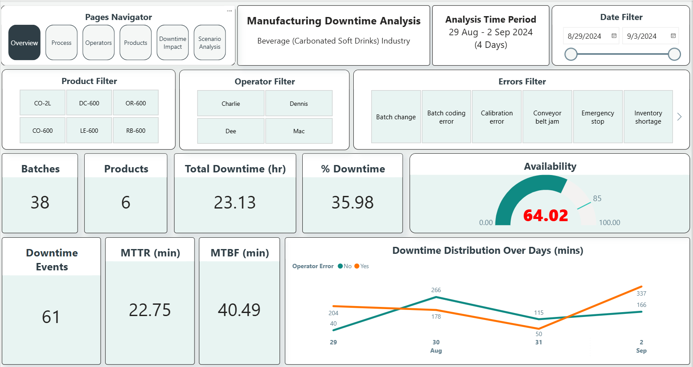
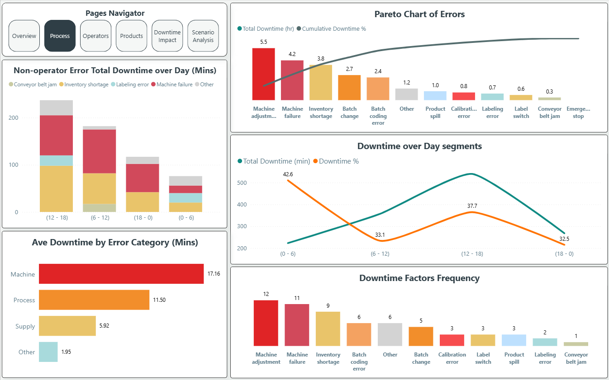
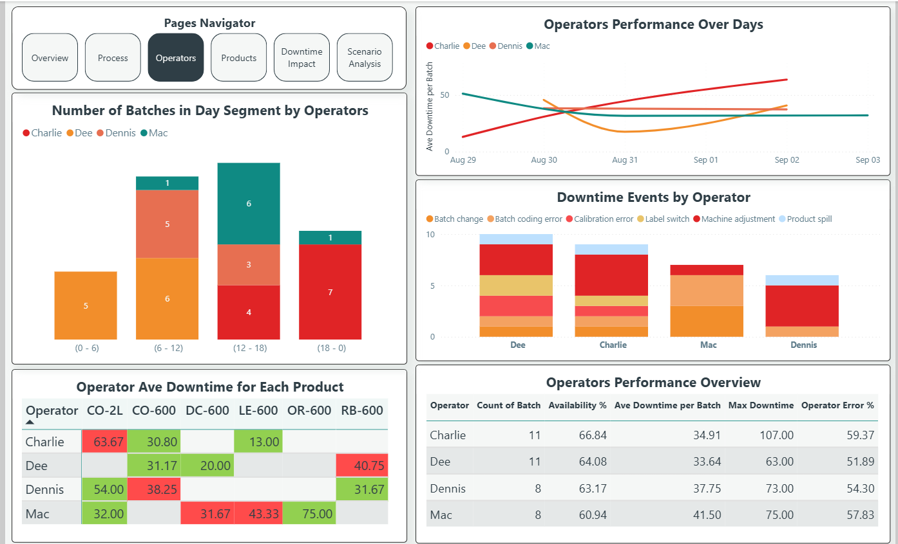
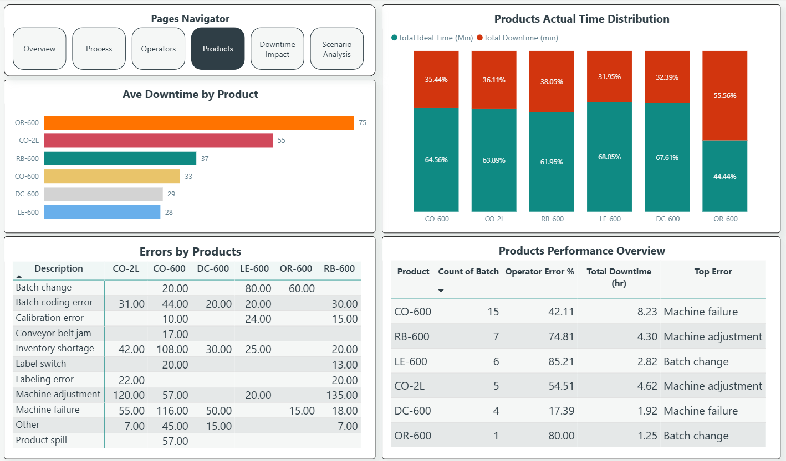
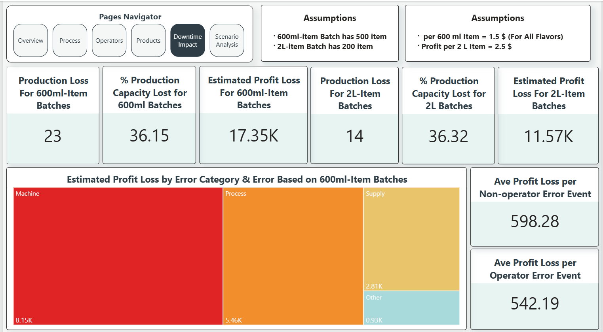
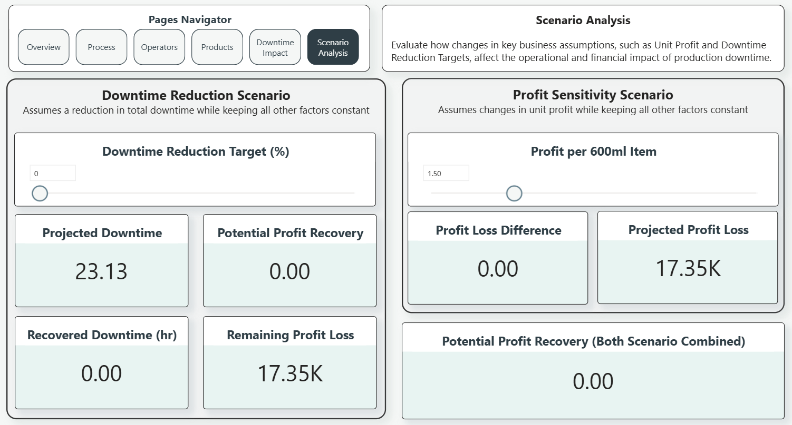

# Manufacturing Downtime Analytics

> **A dynamic & scalable Power BI solution for manufacturing downtime analysis, operational performance monitoring, business impact evaluation, and scenario analysis.**

---

# 📖 Project Overview

Manufacturing downtime directly affects production efficiency, equipment utilization, and operational profitability. Identifying where downtime occurs, understanding its root causes, and evaluating its business impact are essential for improving manufacturing performance.

This project presents a dynamic and scalable **Business Intelligence solution** developed using **Microsoft Power BI** to analyze manufacturing downtime in a **Carbonated Soft Drinks (CSD) manufacturing facility**.

The solution transforms production and downtime records into interactive dashboards that enable performance monitoring, root cause analysis, business impact evaluation, and scenario-based operational planning.

---

# ✨ Features

- Interactive manufacturing performance dashboard
- Production downtime monitoring
- Downtime root cause analysis
- Product and operator performance analysis
- Operational KPI tracking
- Estimated business impact analysis
- Interactive What-If scenario analysis
- Dynamic filtering and drill-down capabilities
- Scalable data model designed to support continuously growing production data

---

# 🛠️ Tech Stack

- Microsoft Power BI
- Power Query
- DAX
- Data Modeling (Galaxy Schema)
- Microsoft Excel

---

# 📊 Dashboard Pages

### 1. Overview

Provides an executive summary of production performance using key operational KPIs, including Availability, MTTR, MTBF, Downtime Events, and Total Downtime.

### 2. Process

Analyzes downtime patterns across production processes to identify major downtime categories, root causes, operational bottlenecks, and shift performance.

### 3. Operator

Evaluates operator performance by comparing downtime events, operator-related errors, and operational efficiency across different operators.

### 4. Product

Compares production performance across products, highlighting downtime distribution, production efficiency, and product-specific operational challenges.

### 5. Downtime Impact

Estimates the operational and financial impact of downtime using predefined business assumptions to quantify production and profit losses.

### 6. Scenario Analysis

Provides interactive What-If analysis that allows users to simulate downtime reduction scenarios and estimate potential operational and business improvements.

---

# 📈 Key KPIs

- Availability %
- Total Downtime
- Downtime Events
- MTTR
- MTBF
- Downtime %
- Estimated Profit Loss
- Production Loss
- Potential Profit Recovery

---

# 📷 Dashboard Preview

### 1. Overview

---

### 2. Process

---

### 3. Operators

---

### 4. Products

---

### 5. Downtime Impact

---

### 6. Scenario Analysis

---

# 👥 Team

Meet the project team and contributors in **[CONTRIBUTORS.md](CONTRIBUTORS.md)**.

---

# 📂 Dataset

The dataset used in this project is available in the **[Manufacturing_Downtime-Dataset](Manufacturing_Downtime-Dataset)** folder.

Contents:
- **Manufacturing_Line_Productivity.xlsx** — Production and downtime records used for dashboard development.
- **data_dictionary.csv** — Description of dataset fields and column definitions.

---

#  Acknowledgment

This project was developed as the **final graduation project** for the **Digital Egypt Pioneers Initiative (DEPI)** – **Data Analysis Track**.

It demonstrates how manufacturing production data can be transformed into actionable operational insights through a dynamic and scalable Business Intelligence solution built with Microsoft Power BI.
